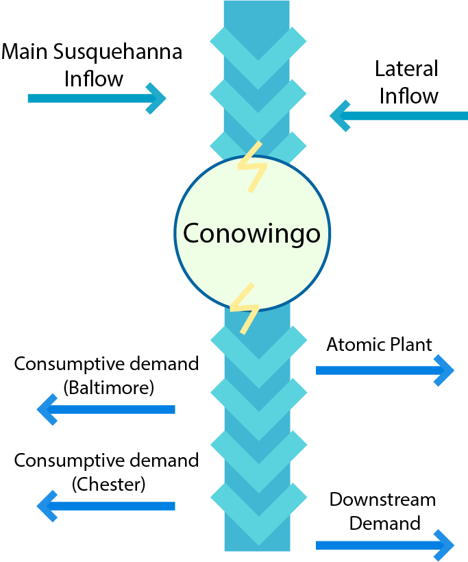

### Susquehanna
<!-- start implemented simulations -Susquehanna -->
The Susquehanna River, regulated by the Conowingo Dam, supports diverse needs, including hydroelectric power, water supply, and recreation. However, low-flow conditions create challenging trade-offs, forcing Conowingo to balance energy production with environmental and community water needs.

Originally, the simulation starts at **(2021, 1, 1)** and the decisions are made every 4 hours throughout a year resulting in **2190 time steps** per episode (the whole simulation). It also has 6 following objectives:


1. <span style="color:blue"> Recreation (max), ref point: 0.0<span style="color:blue">
2. <span style="color:blue"> Energy revenue (max), ref point: 0.0 <span style="color:blue">
3. <span style="color:blue"> Baltimore (max), ref point: 0.0  <span style="color:blue">
4. <span style="color:blue"> Atomic (max), ref point: 0.0 <span style="color:blue">
5. <span style="color:blue"> Chester (max), ref point: 0.0 <span style="color:blue">
6. <span style="color:blue"> Environment (min), ref point: -2190 <span style="color:blue">

Where max/main signifies whether an objective is to be maximised or minimised. The reference point is used for calculating hypervolume as the worst case scenario in terms of acquired rewards by the agent at the end of the simulation.


- Observation space: Water level, month (2 dimensions)
- Action space: Release per each reservoir (4 dimensions)

Here you can see a picture visualising Omo river structure:



#### Running

```python
import mo_gymnasium
import morl4water.examples

water_management_system = mo_gymnasium.make('susquehanna-v0')

def run():
    #reset
    obs, info = water_management_system.reset()
    print(f'Initial Obs: {obs}')
    final_truncated = False
    final_terminated = False
    for t in range(10):
        if not final_terminated and not final_truncated:
            action = water_management_system.action_space.sample()
            print(f'Action for month: {t}: {action}')

            (
                        final_observation,
                        final_reward,
                        final_terminated,
                        final_truncated,
                        final_info
                    ) = water_management_system.step(action)
            # print(f'Final final_info: ', final_info)
            print(f'Observation: {final_observation}')
            print(f'Reward: {final_reward}')         
        else:
            break
    return final_observation
run()
```

Taken from: _Muniak, K. (2024). RL4Water: Reinforcement Learning Environment for Water Management (Bachelor’s thesis). Delft University of Technology, Faculty of EEMCS._
<!-- end implemented simulations -Susquehanna -->

