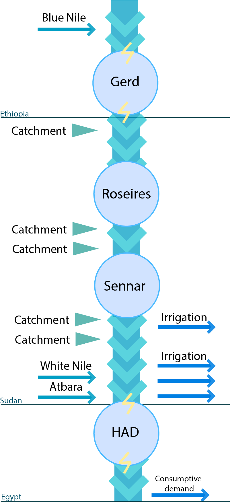

### Nile
<!-- start implemented simulations -Nile -->
The Nile River is a critical resource in northeastern Africa, serving as a water source for hydropower, agriculture, and domestic use across multiple nations. Water rights issues, particularly between Egypt, Sudan, and Ethiopia, have intensified with Ethiopia's construction of the Grand Ethiopian Renaissance Dam (GERD), intended for hydropower generation to boost its economic development.

Originally, the simulation starts at **(2025, 1, 1)** and the decisions are taken on a monthly basis over a 20-year period, resulting in **240 time steps** for each episode. It also has 4 following objectives, we provide reference points for each for hypervolume calculation:

1. <span style="color:blue"> Ethiopia power (max), ref point: 0.0<span style="color:blue">
2. <span style="color:blue"> Sudan deficit (min), ref point: -240 <span style="color:blue">
3. <span style="color:blue"> Egypt deficit (min), ref point: -240 <span style="color:blue">
4. <span style="color:blue"> HAD minimum level (max), ref point 0.0 <span style="color:blue">


Where max/main signifies whether an objective is to be maximised or minimised. The reference point is used for calculating hypervolume as the worst case scenario in terms of acquired rewards by the agent at the end of the simulation.


Where in all cases:
- Observation space: Storage in 4 reservoirs, month (5 dimensions)
- Action space: Release per each reservoir (4 dimensions)

Here you can see a picture visualising Nile river structure:



#### Running Nile

```python
import mo_gymnasium
import morl4water.examples

water_management_system = mo_gymnasium.make('nile-v0')

def run():
    #reset
    obs, info = water_management_system.reset()
    print(f'Initial Obs: {obs}')
    final_truncated = False
    final_terminated = False
    for t in range(10):
        if not final_terminated and not final_truncated:
            action = water_management_system.action_space.sample()
            print(f'Action for month: {t}: {action}')

            (
                        final_observation,
                        final_reward,
                        final_terminated,
                        final_truncated,
                        final_info
                    ) = water_management_system.step(action)
            # print(f'Final final_info: ', final_info)
            print(f'Observation: {final_observation}')
            print(f'Reward: {final_reward}')         
        else:
            break
    return final_observation
run()
```

Taken from: _Sari, Y. (2022). Exploring Trade-offs in Reservoir Operations through Many-Objective Optimization: Case of the Nile River Basin (Master’s thesis). Delft University of Technology._
<!-- end implemented simulations -Nile -->
