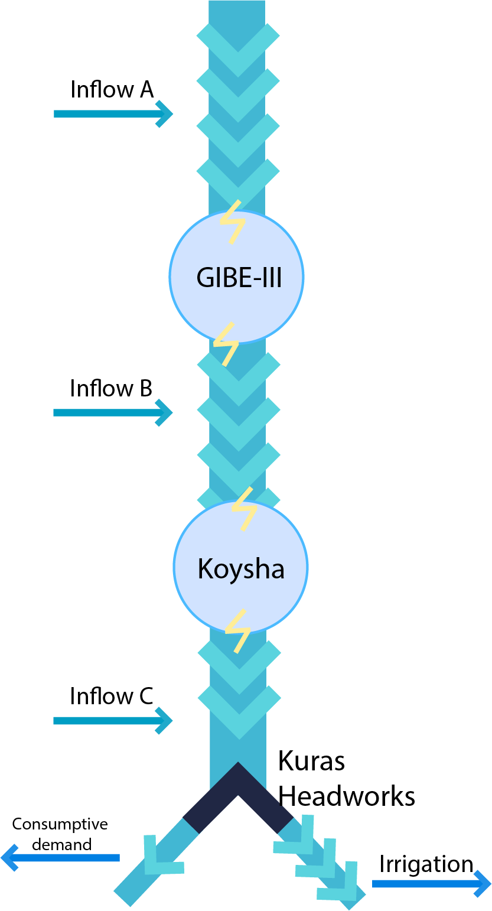

### Omo
<!-- start implemented simulations -Omo -->

*This environment is still under construction*

The Lower Omo-Gibe River Basin in Ethiopia highlights the complex challenges of balancing hydropower, irrigation, and environmental flow needs in a developing region. This model includes key infrastructure like the Gibe III and Koysha dams, the Kuraz sugar plantation irrigation schemes and Omorate town.

Originally, the simulation starts at **(2029, 1, 1)** and the decisions are taken on a monthly basis over a 12-year period, resulting in **144 time steps** for each episode (the whole simulation). It also has 3 following objectives:


1. <span style="color:blue"> Hydropower at Gibe-III and Koysha plants (max), ref point: 0.0 <span style="color:blue">
2. <span style="color:blue"> Kuraz plantation deficit (min), ref point: -144 <span style="color:blue">
3. <span style="color:blue"> Omorate town deficit (min), ref point: -144  <span style="color:blue">


Where max/min signifies whether an objective is to be maximised or minimised. The reference point is used for calculating hypervolume as the worst case scenario in terms of acquired rewards by the agent at the end of the simulation.


- Observation space: Gibe-III reservoir, Koysha reservoir,  month (3 dimensions)
- Action space: Gibe-III reservoir's release, Koysha reservoir's release, Weir(3 dimensions)

The Omo case is unique because, beyond managing reservoir releases, it also involves determining the percentage split of water flow at the weir. This weir does not store water; instead, it divides the flow into two separate streams—one directed toward the Kuraz plantations and the other to Omorate town. 

Here you can see a picture visualising Omo river structure:



#### Running 

```python
import mo_gymnasium
import morl4water.examples

water_management_system = mo_gymnasium.make('omo-v0')

def run():
    #reset
    obs, info = water_management_system.reset()
    print(f'Initial Obs: {obs}')
    final_truncated = False
    final_terminated = False
    for t in range(10):
        if not final_terminated and not final_truncated:
            action = water_management_system.action_space.sample()
            print(f'Action for month: {t}: {action}')

            (
                        final_observation,
                        final_reward,
                        final_terminated,
                        final_truncated,
                        final_info
                    ) = water_management_system.step(action)
            # print(f'Final final_info: ', final_info)
            print(f'Observation: {final_observation}')
            print(f'Reward: {final_reward}')         
        else:
            break
    return final_observation
run()
```

Taken from: _Bangar, Y. (2024). Modeling water resources for everyone: Transparent and effective approaches for complex systems: Case study of the Lower Omo Basin (Master's thesis). Delft University of Technology._
<!-- end implemented simulations -Omo -->


